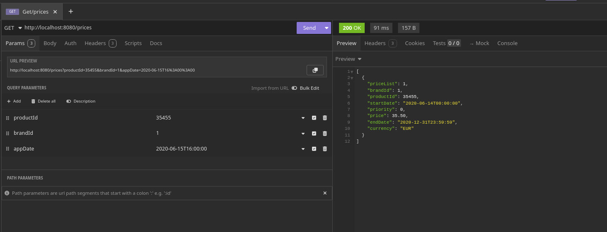
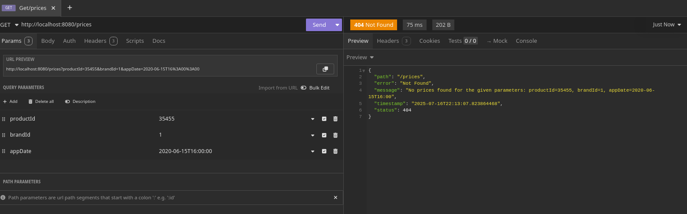
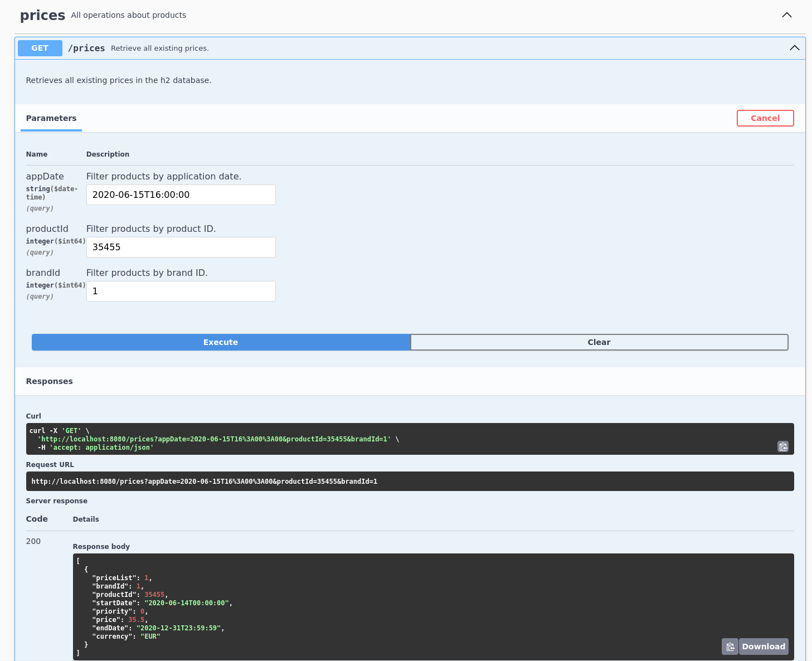
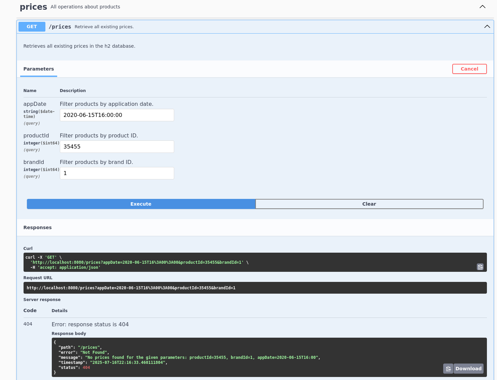

# ProductManager

ProductManager is a Spring Boot application for managing products. It provides RESTful APIs to create, update, retrieve, and delete product information.

## Features

- Product and stock management.
- Clean architecture (ports and adapters).
- Integration with repositories and services.
- Integrated observability and security.
- REST API generated with OpenAPI.

## Project structure
src/main/java/git/francrt/
# Application logic and services
application/ports

application/services
# Input/output/context interfaces (ports)
ports/context

ports/input

ports/output
# Service implementations
services/
services/mapper
# Domain models and exceptions
domain/model

domain/exception
# Adapters, configuration and security
infrastructure/configuration

infrastructure/exception
# Configuration and property files
resources/
# Unit and integration tests
test/java/git/francrt/application

## Requirements

- Java 17+
- Maven 3.8+
- Spring Boot 3.x
- Architecture: Clean Hexagonal Architecture (Ports and Adapters)
- Database: H2 (in-memory for development, can be replaced with any other database)
- Testing: JUnit 5 with direct integration with the in memory database

## Instalation

1. Clone the repository: git clone https://github.com/Francrt/productmanager.git
2. Compile project with: mvn clean install
3. Run the application with: mvn spring-boot:run

## Configuration

Update the files inside `src/main/resources/` to customize your configuration::
- `application.properties`
- `application.yml`
- `swagger.yaml`

## Testing

Run tests with Maven: mvn test

### PriceServiceTest

- Parameterized tests for different date/time requests, product, and brand combinations.
- Verifies that the service returns exactly one price (the one with the highest priority) for each valid request.
- Ensures correct filtering and business logic for price selection.

**Example tested cases:**
- Request at 10:00 on June 14th for product 35455 and brand 1: expects 1 price.
- Request at 16:00 on June 14th for product 35455 and brand 1: expects 1 price.
- Request at 21:00 on June 14th for product 35455 and brand 1: expects 1 price.
- Request at 10:00 on June 15th for product 35455 and brand 1: expects 1 price.
- Request at 21:00 on June 16th for product 35455 and brand 1: expects 1 price.

### Architectural Tests (Naming and Layering)

- Verifies that the project follows the intended hexagonal (ports and adapters) architecture.
- Checks that dependencies between packages (domain, application, infrastructure, etc.) are respected.
- Ensures that domain logic is not coupled to infrastructure or external frameworks.

## Testing Executions

 ### Insomnia

 ### Swagger

## API

API's documentation is automatically generated and stored in: http://localhost:8080/swagger-ui/index.html

## Author
Francrt

